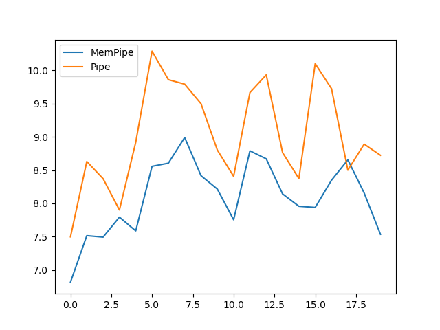

# mempipe

This package combines the simplicity of using Python's `multiprocessing.Pipe()` with the speed of `multiprocessing.shared_memory.SharedMemory`.
Meant for a multiprocessing data analysis pipeline where each process analyses the data and passes it to the next process for the next step.

The passed data can only be a numpy array.

Originally designed for a real-time Brain-Computer-Interface application.

## How to use

Import the `MemPipe` class.
Make an instance object.
Call `YourMemPipeInstance.Pipe()` instead of the `multiprocessing.Pipe(duplex=False)` in your applicaiton.

The pipe objects support `poll()`, `recv()`, and `send()`.
Before calling `recv()`, you must call `poll()` and make sure it returns `True` (as you would normally).

All else is handled internally.
My simple simulation (found here: [./tests/test3.py](./tests/test3.py)) shows that passing a numpy array of $12000 \times 4000$ is much faster this way, compared to regular pipes.

  
20 repeatitions on the x-axis, and the execution time on the y-axis.
